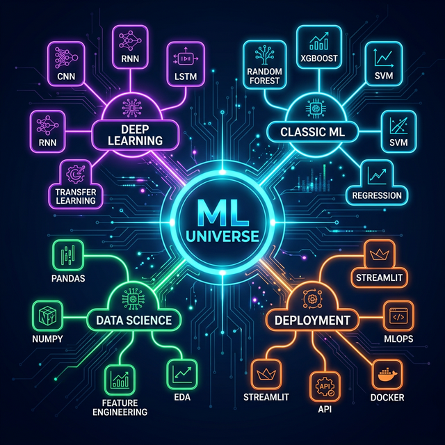

 

 &nbsp;
 &nbsp;

 

> *"Most people stare at data. I make it talk."*

---

## ⚡ tl;dr — who is this guy?

**ML Engineer** who turns messy data into things that actually work. I've shipped **40+ projects** — from training neural nets on medical voice data to building real-time dashboards that people actually use. I don't just learn algorithms, I deploy them.
 
Currently obsessed with: **Deep Learning at scale** · **MLOps pipelines** · **Building AI tools no one asked for but everyone needs**

 

---

## 🗺️ How My Brain Works — The Skill Map

 

 

---

## 🔥 The Highlight Reel

> *These aren't course projects. These are things I actually built, broke, rebuilt, and shipped.*

<table>
<tr>
<td width="50%" valign="top">

### 📈 TimeSeries-Au — Gold Price Oracle
LSTM-powered gold price prediction system that **auto-retrains daily** via GitHub Actions. Live market data from YFinance → deep learning → forecasts that actually mean something. While you sleep, this thing is learning.

**`TensorFlow` `LSTM` `Streamlit` `GitHub Actions`**

</td>
<td width="50%" valign="top">

### 📰 News Curator — AI-Powered News Engine
Smart news curation app that filters the noise and surfaces what matters. Custom algorithms + clean UI = finally, a news feed that doesn't make you dumber.

**`Python` `NLP` `Streamlit`**

</td>
</tr>
<tr>
<td width="50%" valign="top">

### 🔴 RedGlyph — AI Code Reviewer
Your virtual **senior engineer** that never sleeps. Paste code → get roasted with bug reports, security flags, anti-patterns & a quality score. Powered by **Gemini 2.5 + LangGraph** with 60fps GPU-composed UI animations. Code review, but make it ruthless.

**`FastAPI` `Gemini 2.5` `LangGraph` `Docker`**

</td>
<td width="50%" valign="top">

### 🤟 ASL Digit Recognition (Real-Time)
CNN + OpenCV = real-time American Sign Language digit recognition from your webcam. Computer vision that actually does something cool.

**`TensorFlow` `OpenCV` `CNN`**

</td>
</tr>
<tr>
<td width="50%" valign="top">

### 👁️ Brand-Spotter — AI Logo Recognition
CNN that identifies company logos from images with scary accuracy. Upload a photo → instantly know the brand. Computer vision that's actually useful for real-world brand detection.

**`TensorFlow` `CNN` `Streamlit` `OpenCV`**

</td>
<td width="50%" valign="top">

### 🤖 AI Discord Assistant
Built a Discord bot powered by **Ollama + FastAPI**. It chats, it helps, it lives in the server 24/7. Basically made my own little Jarvis for Discord.

**`Python` `FastAPI` `Ollama`**

</td>
</tr>
</table>

 

---
